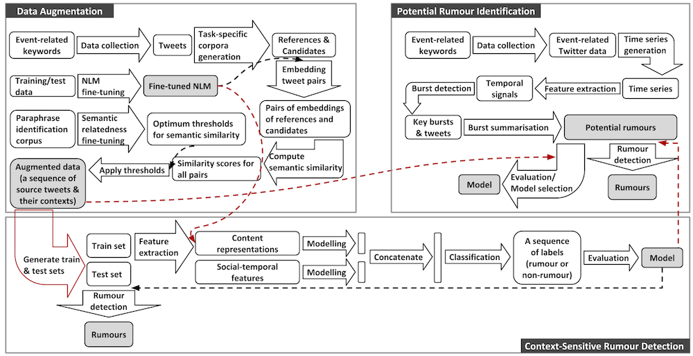

<h2>Current projects</h2>

<h3>Explainable Depression Detection on Social Media</h3>

Depression is a serious health and social issue that afflicts many individuals in modern society and its prevalence is predicted to increase globally. People with depression are likely to express their feelings and mental states over their social media before seeing health professionals. Most existing black-box-like deep learning methods for depression detection largely focused on improving classification performance. However, explaining model decisions is imperative in health research because decision-making can often be high-stakes and life-and-death. Reliable automatic diagnosis of mental health problems including depression should be supported by credible explanations justifying models' predictions. This project aims to develop automatic, efficient solutions for depression detection. Potentially, outcomes of this project can help patients conduct a self-assessment of risks for their mental disorders and better understand their experiences and health professionals provide tailored, timely therapy to patients, thereby achieving remission and preventing relapse efficiently and effectively.

<h3>Human-Robot Collaborative Al for Advanced Manufacturing and Engineering, S$1,962,800 (Oct 2021-present)</h3>

This collaborative research project, involving A*STAR, Nanyang Technological University, National University of Singapore and Singapore University of Technology and Design, seeks to enable a fundamental shift in human-machine interaction to allow intelligent machines to work alongside humans as partners, interacting in a natural human-like manner. In particular, I focus on developing a multi-layer, multi-domain and multi-modal commonsense knowledge representation and a suite of reasoning strategies to leverage such knowledge to support higher level inference involved in perception and task understanding, collaborative dialogue, human mental state inference, task concept and script learning, and task planning and execution.

<h2>Past projects</h2>

<h3>Governmental Requests for Information Decomposition, Undisclosed amount (Jan-Mar 2022)</h3>

Requests for Information (RFIs) seeking the clarification of questions asked are an imperative communication process in decision-making. I am interested in accelerating and optimising the handling of RFIs with a minimum of human supervision. This projects develops, implements and demonstrates computational solutions for optimally matching a textual question with limited context to the most relevant subset of information resources to answer the question. This project is funded by the Defence Science and Technology Laboratory (Dstl), an executive agency of the Ministry of Defence of the UK.

<h3>Bot/Cyborg detection, Undisclosed amount (Jan 2020-March 2022)</h3>

Requests for Information (RFIs) seeking the clarification of questions asked are an imperative communication process in decision-making. I am interested in accelerating and optimising the handling of RFIs with a minimum of human supervision. This projects develops, implements and demonstrates computational solutions for optimally matching a textual question with limited context to the most relevant subset of information resources to answer the question. This project is funded by the Defence Science and Technology Laboratory (Dstl), an executive agency of the Ministry of Defence of the UK.

<h3>Context-aware message-level rumour detection with weak supervision</h3>

This research project focuses on researching early rumour detection (ERD) on social media by exploiting  weak supervision and contextual information. Weak supervision is a branch of Machine Learning (ML) where noisy and less precise sources (e.g. data patterns) are leveraged to learn limited high-quality labelled data. This is intended to reduce the cost and increase the efficiency of the hand-labelling of large-scale data. 

The aim is to study whether identifying rumours before they go viral is possible and develop an architecture for ERD at individual post level. To this end, it first explores the following three major bottlenecks of state-of-the-art ERD: 
<ol>
  <li>labelled data scarcity and class imbalance</li>
  <li>enormous amounts of noisy data</li>
  <li>the limited availability of context in message-level ERD</li>
</ol>
Figure 1 visualises an overview of research design for addressing the bottlenecks introduced above. This project also uncovers a research gap between system design and its applications in the real world, which have received less attention from the research community of ERD. 
 

<figure>
  
  <figcaption>Figure 1: Project overview</figcaption>
</figure>
  
